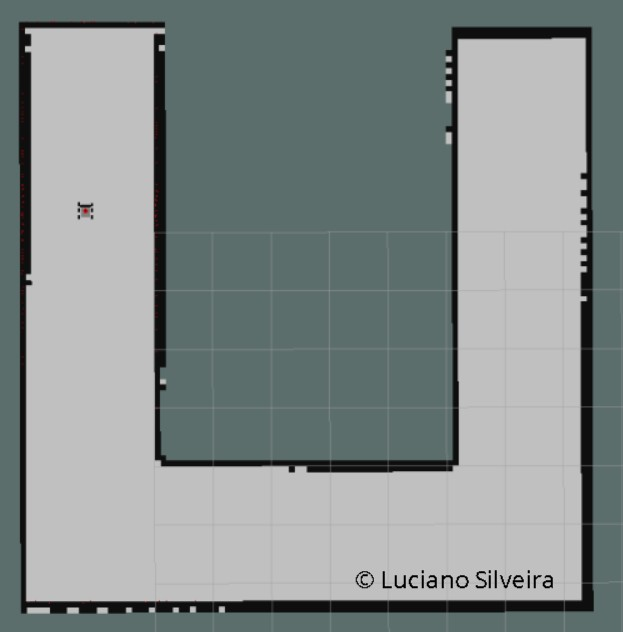

# RoboND-HomeServiceRobot-Project-P9
Home Service Robot

## Abstract

SLAM or Simultaneous Localization and Mapping is an important topic within the Robotics community. It is not a particular algorithm or piece of software, but rather it refers to the problem of trying to simultaneously localize (i.e. find the position/orientation of) some sensor with respect to its surroundings, while at the same time mapping the structure of that environment.

The Home Service Robot project creates a local world to deploy a rover programmed to go to a specific location to mimic picking up an object and then move it to a new location to a drop-off area.

## Introduction

SLAM is central to a range of indoor, outdoor, in-air and underwater applications for both manned and autonomous vehicles. It is known to be a difficult problem because it is a chicken-or-egg problem where a map is needed for localization and a pose estimate is needed for mapping.

In our simulation environment a rover called `ls_bot` is equipped with a RGB-D camera and a Lidar sensor and is driven around two generate a map; the objective is to create a 2D representation of its surroundings.

The `ls_bot` is an extension from the [rocker-bogie project](https://github.com/SyrianSpock/rover). Several changes were needed to make to compile using the ROS Kinetic Kame default infrastructure. The sensory information was added using the [Gazebo plugins reference](http://gazebosim.org/tutorials?tut=ros_gzplugins). The visualization in [Rviz](http://wiki.ros.org/rviz) is as follows:


The Home Service Robot project creates a world using the [Gazebo](http://gazebosim.org/) simulator. The first task is to map it using a node called wall_follower. Once the mapping is done a map file is created and the [AMCL](http://wiki.ros.org/amcl) node is used to localize the rover within the environment. Using the [Move Base](http://wiki.ros.org/move_base) stack; the rover must navigate it's environment to pick up an object and go to a drop-off area. The simulation uses markers to signal pick-up and drop-off zones.

## Background

The tasks required to complete the project are:

 * Design a simple environment using the Building Editor in Gazebo.
 * Teleoperate the robot and manually test SLAM.
 * Create a wall_follower node that autonomously drives the robot to map the environment.
 * Use the 2D Nav Goal arrow in rviz to move to two different desired positions and orientations.
 * Write a pick_objects node in C++ that commands the robot to move to the desired pickup and drop off zones.
 * Write an add_markers node that subscribes to robot odometry keeping track of the robot pose, and publishes markers to rviz.
 * Combine all of the forgoing to simulate a robot moving to a pick up point, and carrying a virtual object to a dropoff point.

## Results

Initially the U-shaped world was created with the Building Editor in Gazebo.

### Mapping

The provided `teleoperation` utility was used to move the rover; the [steering plugin](http://wiki.ros.org/rqt_robot_steering) from the rqt ROS utilities was tested and the `wall_follower` node generating a map. The result is the following map:



```sh
cd ~/<ProjectName>/ros
./src/ShellScripts/test_slam.sh
```

### Navigation

The localization is solved with the [AMCL](http://wiki.ros.org/amcl) node and Navigation uses the [Move Base](http://wiki.ros.org/move_base) stack.

```sh
cd ~/<ProjectName>/ros
./src/ShellScripts/test_navigation.sh
```
A sample result using th 2D [Rviz](http://wiki.ros.org/rviz) options is detailed as follows:


### Pick up, Drop off objects and Markers

To write the [pick_objects](./ros/src/pick_objects/src/pick_objects.py) node some ideas were taken from [here](https://github.com/markwsilliman/turtlebot/blob/master/go_to_specific_point_on_map.py).

The pick-up location `'x': -6.44562959671, 'y' : 1.26055216789` is marked as follows:


While the drop-of location `'x': 0.128987312317, 'y' : -1.71386241913` using the `/markers/path` topic.


To execute it:

```sh
cd ~/<ProjectName>/ros
./src/ShellScripts/pick_objects.sh # pick objects only
./src/ShellScripts/add_markers.sh # markers only
```
The following output is detailed:

```sh
$ rosrun add_markers add_markers.py
[INFO] [1552959857.090800, 2475.324000]: Pick Up marker (-6.44562959671, 1.26055216789)
[INFO] [1552959868.123470, 2485.325000]: Drop-off marker (0.128987312317, -1.71386241913)
```

The following steps were followed:

 * Publish the marker at the pickup zone and use Move Base to navigate.
 * When the rover reaches the pickup zone, hide the marker and wait for 5 seconds.
 * Publish the marker at the drop off zone and use Move Base to navigate.

### Home Service

The Home Service script combines everything; simulating a robot moving to a picking point, waiting for 5 seconds and carrying a virtual object to a drop-off location.

```sh
cd ~/<ProjectName>/ros
./src/ShellScripts/home_service.sh
```

A sample result can be validated [here](./data/sample01.mp4).

## Discussion

The project successfully navigates the environment once the map is created.

Instead of using odometry information to signal pick-up and drop-off locations a different strategy was followed. Use two new topics passing a Bool parameter to signal it, called `pick_flag` and `drop_flag`. The [add_markers](./ros/src/add_markers/src/add_markers.py) node will subscribe to both and add/remove the marker when needed:

```sh
def pick_callback(self, b):
    ''' pick up flag '''
    if b.data is True:
        rospy.loginfo("Received pick-up marker (%s, %s)", self.pick_position['x'], self.pick_position['y'])
        self.publish_marker(self.pick_position, 1., 0., 0., 1., 1, 0, scale=0.2) # Blue sphere
    else:
        rospy.loginfo("deleting pick-up marker")
        self.delete_marker(1)

def drop_callback(self, b):
    ''' drop off flag '''
    if b.data is True:
        rospy.loginfo("Received drop-off marker (%s, %s)", self.drop_position['x'], self.drop_position['y'])
        self.publish_marker(self.drop_position, 1., 1., 0., 0., 2, 1, scale=0.2) # Red cube
    else:
        rospy.loginfo("deleting drop-off marker")
        self.delete_marker(2)
```

### Considerations

Python was used to move the rover using the standard Move_Base infraestructure. The default tolerance parameters were changed to discard rover orientation using the following [answer](https://answers.ros.org/question/55294/give-move_base-goalpoints-without-orientation/).

```
yaw_goal_tolerance: 3.14
xy_goal_tolerance: 0.3
```

## Conclusion / Future Work

The objective to create a Home service robot was achieved.

The project was run on the Virtual Machine provided. To minimize the usage of resources it was decided to run the Gazebo environment without a GUI and only use RViz for validation through sensory information.

In order to get a better localization, `ls_bot` used the Dynamic Window Approach `dwa_local_planner/DWAPlannerROS` local planner instead of the default `base_local_planner/TrajectoryPlannerROS`. In this way, the rover better navigated the environment using AMCL plus Move Base stacks.

### Links:
 * [Gazebo](http://gazebosim.org/)
 * [Gazebo Model creation](http://playerstage.sourceforge.net/doc/Gazebo-manual-svn-html/tutorial_model.html)
 * [RViz](http://wiki.ros.org/rviz)
 * [Gazebo plugins](http://gazebosim.org/tutorials?tut=ros_gzplugins)
 * [SetupOnYourRobot withb rtabmap](http://wiki.ros.org/rtabmap_ros/Tutorials/SetupOnYourRobot)
 * [What is SLAM?](https://www.kudan.eu/kudan-news/an-introduction-to-slam/)
 * [Sending Simple Goals](http://wiki.ros.org/navigation/Tutorials/SendingSimpleGoals)
 * [Udacity wall_follower](https://github.com/udacity/RoboND-PathPlanning/blob/master/wall_follower.cpp)
 * [gmapping](http://wiki.ros.org/gmapping)
 * [turtlebot_teleop](http://wiki.ros.org/turtlebot_teleop)
 * [turtlebot_rviz_launchers](http://wiki.ros.org/turtlebot_rviz_launchers)
 * [turtlebot_gazebo](http://wiki.ros.org/turtlebot_gazebo)